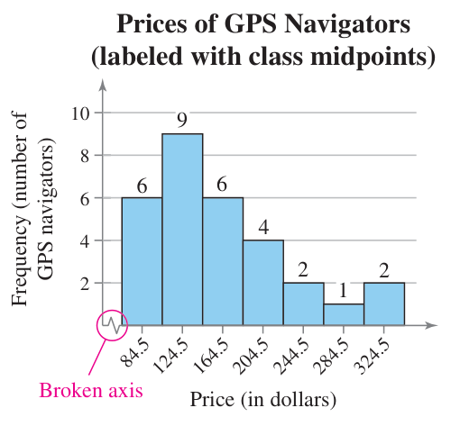
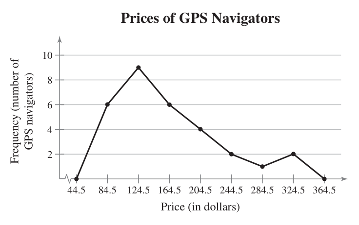
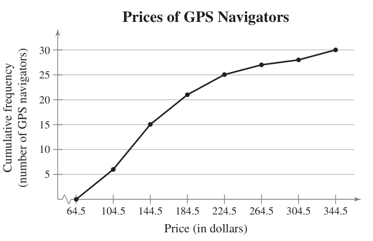

Vocabulary words: **10** | [Slideshow version](https://1drv.ms/p/s!ApcrauBhfAnEj-g3w0e3c0h1FcA6EQ?e=vPDs5t)

Jump to the [Frequency Distribution Steps](#frequency-distribution-steps) we wrote out in class.

## Frequency Distributions

Picking up on patterns when data has many different entries can be tricky. If you were to list the GPA of every student in the senior, it would be a very long list and have little repetition.

So one way to present this data so we can make some sense of it is to group them together into **classes** (also called intervals) and list how many entries are in that class.  Here's the GPA frequency distribution.

| Class   | Frequency, $f$ |
| ------- | :------------: |
| 1.6–2.0 |       8        |
| 2.1–2.5 |       20       |
| 2.6–3.0 |       26       |
| 3.1–3.5 |       36       |
| 3.6–4.0 |       33       |
| >4.0    |       5        |

A **frequency distribution** is a table that shows classes of data entries with a count of the number of entries in each class. The **frequency $f$** of a class is the number of data entries in the class.

Here's the steps too building a frequency distribution.

### Constructing a Frequency Distribution from a Data Set

1. Decide on the number of classes to include in the frequency distribution. The number of classes should be between 5 and 20; otherwise, it may be difficult to detect any patterns.
2. Determine the class width. Determine the **range** of the data by finding the difference between the maximum and minimum entries. Then divide the range by the number of classes and _round up to the next convenient number_.
3. Find the class limits. You can use the minimum data entry as the lower limit of the first class. Then find the rest of lower limits by continuously adding the class width to the lower limit of the preceding class. Stop when you have the number of classes you need, then find the upper limits by choosing an appropriate number that doesn't overlap with another class.
4. Make a tally mark for each data entry in the row of the appropriate class.
5. Count the tally marks to find the total frequency $f$ for each class.

### Example

Let's try one out. Here's a bunch of data. It's the price of 30 different GPS navigation systems, something no one uses anymore because we all have cell phones.

```text
128  100  180  150  200  90   340  105   85  270 
200   65  230  150  150  120  130  80   230  200 
110  126  170  132  140  112   90  340  170  190 
```

Let's make a frequency distribution with seven classes, so let's find the range and then get the class widths. Our maximum entry is 340 and the minimum is 65.

$$ (340 - 65) / 7 \approx 39.3 $$

That's close enough to 40, so we have our class width. Let's start with 65 as the lower limit for our first class, and add our width until we have seven numbers.

$$ 65, 105, 145, 185, 225, 265, 305 $$

No we need the upper limits. Here, we'll just drop down one from the next lower limit.

$$ 104, 144, 184, 224, 264, 304, 344 $$

For that last one, I just pretended we had one more class, then dropped it down one.

Now we can start building our table, making sure to have a column to tally up each entry.

|  Class  | Tally | Frequency, $f$ |
| :-----: | ----- | -------------- |
| 65–104  |       |                |
| 105–144 |       |                |
| 145–184 |       |                |
| 185–224 |       |                |
| 225–264 |       |                |
| 265–304 |       |                |
| 305–344 |       |                |

Once you work your way though each entry, you should have the finished table.

|  Class  | Tally                 | Frequency, $f$  |
| :-----: | --------------------- | :-------------: |
| 65–104  | ~~\|\|\|\|~~ \|       |        6        |
| 105–144 | ~~\|\|\|\|~~ \|\|\|\| |        9        |
| 145–184 | ~~\|\|\|\|~~ \|       |        6        |
| 185–224 | \|\|\|\|              |        4        |
| 225–264 | \|\|                  |        2        |
| 265–304 | \|                    |        1        |
| 305–344 | \|\|                  |        2        |
|         |                       | $\Sigma f = 30$ |

The last row is just the sum of all the frequencies as check if each entry was counted. The Greek letter $\Sigma$ (sigma) is typically used in math to mean "sum".

### Additional Features

Let's add some things to the table that might help give us a better idea of what's going on in the data.

First is the **midpoint**, which you can find by adding each class's upper and lower limits and dividing by two. This number can sometimes be more easy to communicate than the entire class range.

Next is the **relative frequency**, which is what percentage of the entries fall into each class. That you can simply find by taking the frequency of each class and dividing it by the total number of entries.

The last one we'll cover is the **cumulative frequency**, which is just the total frequency of the current class and all the ones below it.

So, let's update our table from above. I'll skip writing out the math steps here, but make sure you work out some of them on your own so can see where they come from. We're also going to add up out relative frequency to make sure we hit 100%.

|  Class  | Tally                 | Frequency, $f$  | Midpoint |       Relative Frequency       | Cumulative Frequency |
| :-----: | --------------------- | :-------------: | :------: | :----------------------------: | :------------------: |
| 65–104  | ~~\|\|\|\|~~ \|       |        6        |   84.5   |              0.20              |          6           |
| 105–144 | ~~\|\|\|\|~~ \|\|\|\| |        9        |  124.5   |              0.30              |          15          |
| 145–184 | ~~\|\|\|\|~~ \|       |        6        |  164.5   |              0.20              |          21          |
| 185–224 | \|\|\|\|              |        4        |  204.5   |              0.13              |          25          |
| 225–264 | \|\|                  |        2        |  244.5   |              0.07              |          27          |
| 265–304 | \|                    |        1        |  284.5   |              0.03              |          28          |
| 305–344 | \|\|                  |        2        |  324.5   |              0.07              |          30          |
|         |                       | $\Sigma f = 30$ |          | $\Sigma \frac{f}{n} \approx 1$ |                      |

Now we can start looking for patterns. The \\$105–\\$144 price range seems to be the most common (but not necessarily the most popular amongst consumers) with 30% of the devices surveyed falling in that range. Along with that, half of the survey devices fall under \\$144. Looking further, 70% of the devices fall into the first three classes, so less than \\$184.

## Graphs of Frequency Distributions

### Histograms

**Histograms** are bar graphs, but where bar graphs have qualitative data as the horizontal axis, histograms have quantitative data. This also means the bars must touch, showing that there isn't a gap in the data (unless there actually is a gap because a class is empty).

We can either make a frequency histogram or a relative frequency histogram based on our data. The only difference between the two is the vertical scale—one showing the number of entries in a class and the other the percentage of total entries. 

Below is a frequency histogram. Notice that both axes are labeled with units, price and frequency, and that there is a broken axis on the horizontal one. These are important since they show that a large range of numbers was skipped. In this case, everything below our minimum price of $65.



### Frequency Polygons

With **frequency polygons**, we use dots instead of bars and then connect them with a line. Here's the same data now in a polygon chart. Two extra points are added, basically extra classes on each end that are useful for marking zero.



You can also do a **cumulative frequency polygon**, also known as an **ogive** (pronounced _oh-jive_).



---

## Frequency Distribution Steps

### Lower Limits

1. Range = max - min
2. Class width = range / # of classes
    - Round up to the nearest whole number
3. Starting with min, add class width. Repeat until you have desired # of classes.

### Upper Limits

1. First class is one less than the lower limit of second class.
2. Add class width until you have all upper limits.
    - You could repeat step 1, but you will still need to add the class width to get the last one.

### Mid-Points

1. Add upper and lower limit pairs.
2. Divide each sum by 2.