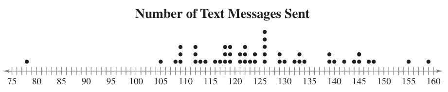
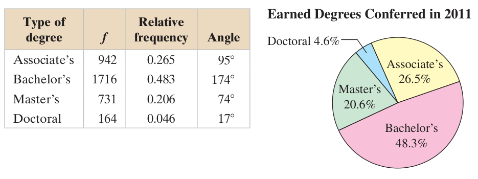
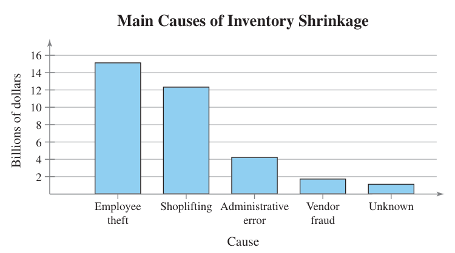
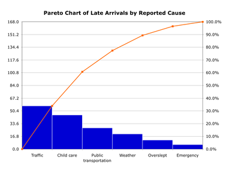
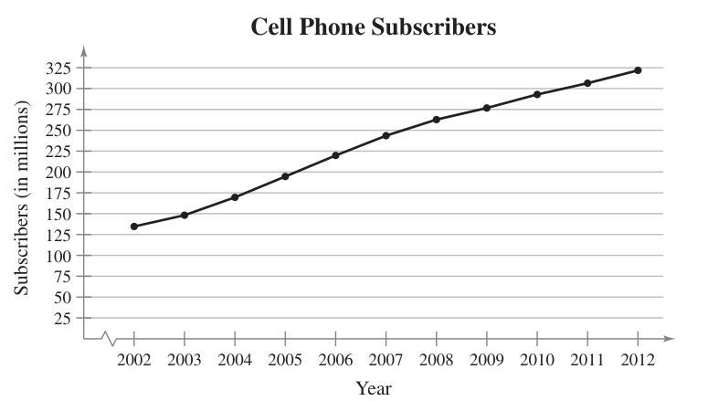

Vocabulary words: **9** | [Slideshow version](https://1drv.ms/p/s!ApcrauBhfAnEj-ldFoPtyVTCjwAK-A?e=47V4GS)

## Graphing Quantitative Data

### Stem-and-Leaf Plots

In **steam-and-leaf plots**, data entries are broken into **stems**, typically the left most digits, and **leafs**, the right-most digits. Here's a bunch of entries for the number of texts send out by students in a given week. Keep in mind that these are only for quantitative data.

```text
155 159 144 129 105 145 126 116 130 114
122 112 112 142 126 118 118 108 122 121
109 140 126 119 113 117 118 109 109 119
139 139 122  78 133 126 123 145 121 134
124 119 132 133 124 129 112 126 148 147
```

And here it is presented in steam-and-Leaf format.

#### Number of Text Messages Sent

Key: 15|5 = 155

```text
 7 | 8             
 8 | 
 9 |
10 | 5 8 9 9 9
11 | 2 2 2 3 4 6 7 8 8 8 9 9 9
12 | 1 1 2 2 2 3 4 4 6 6 6 6 6 9 9
13 | 0 2 3 3 4 9 9
14 | 0 2 4 5 5 7 8
15 | 5 9
```

Notice that this is similar to a histogram. Data is stored in classes (your stems) and each leaf adds on to the length of a class, so you can see its shape.

Here's a version where each stem is listed twice, with the first having the leafs 0–4 and the second 5–9. This is helpful if there is too much data for a given class.

#### Number of Text Messages Sent Variation

Key: 15|5 = 155

```text
 7 |
 7 | 8             
 8 |
 8 | 
 9 |
 9 |
10 |
10 | 5 8 9 9 9
11 | 2 2 2 3 4
11 | 6 7 8 8 8 9 9 9
12 | 1 1 2 2 2 3 4 4
12 | 6 6 6 6 6 9 9
13 | 0 2 3 3 4
13 | 9 9
14 | 0 2 4
14 | 5 5 7 8
15 | 
15 | 5 9
```

### Dot Plot

A more visual way to describe quantitative data is with a **dot plot**. It involves a number line covering your range of data with dots representing where entries lie. Repeats are stacked.

<center></center>

## Graphing Qualitative Data

### Pie Charts

A **pie chart** is a circle broken into sectors, with the size of each sector being proportional to the frequency of each category.

<center></center>

You need to calculate percentages for each category, regardless of whether you display that or the raw numbers on the chart itself. The percentage will be used to calculate the angle. So, for the Associate's category, it has 26.5% of the data in it. That means its associated sector will be 26.5% of the circle.

$$ 0.265 \cdot 360^\circ \approx 95^\circ $$

We'll make these on the computer, since drawing accurate circles and angles is beyond what we want to accomplish here.

### Pareto Charts

A **Pareto[^1] chart** is a name for a bar chart where the categories are in descending order of frequency. So, the category with highest number of entries, and the highest bar, is on the far left of the chart.

<center></center>

They are often overlaid with a cumulative frequency polygon.

<center></center>

## Graphing Paired Data Sets

If one data entry corresponds with exactly one other entry, they are referred to as **paired data sets**. One way to graph paired data is with a **scatter plot**, where the data pairs appear as coordinate pairs on the chart.

<center></center>

Similar to a scatter plot is a **time series**, where data is recorded at regular intervals. Here, a line connects each point. Below is an example of annual record of the number of cell phone subscribers from 2002–2012.

<center></center>

[^1]: It's named after the Pareto principle, an efficiency principle that's also known as the 80/20 rule. It states that 80% of consequences come from 20% of the causes. Vilfredo Pareto, an Italian polymath (someone who studied many topics), is credited as the first to take notice the effect when looking at land ownership.
