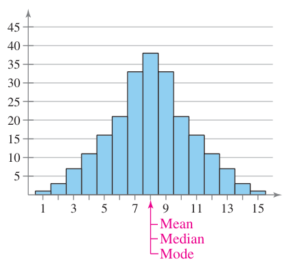
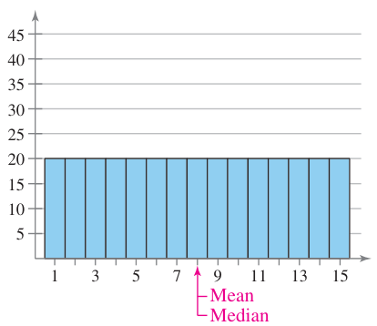
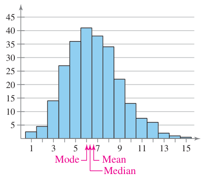

## Mean, Median and Mode

**Mean** is the sum of the data entries divided by the number of entries. In statistics, variables are used to represent the mean, but different ones are used depending on if we are using a population or sample.

$$ \text{Population: }\mu = \frac{\Sigma x}{N} \qquad \text{Sample: }\bar{x} = \frac{\Sigma x}{n} $$

For population, the Greek letter μ ("mu)" and _N_ are used, but when it's a sample we use $\bar{x}$ ("_x_ bar") and _n_. This is done to make it clear that we are either taking about a parameter, a fact about a population, or a statistic, something taken from the sample.

In both cases, the Green letter Σ ("sigma") represents "sum of", that we are adding up all the data entries.

> **A quick note about the word "average"**. Words are jazz and people tend to do whatever they want with them in casual speech. The word "average" is a casualty of this. An average is any single number or value that best represents a set of data. Most people have gone on to assume that average means taking the sum of everything and dividing by the number of items, but median or mode could be a better representation depending on the situation.

The **median** of a set of data is the middle number when they are arranged in order. If you have an odd number of entries, this is straightforward.

$$ 3 \quad 4 \quad 5 $$

But when you have an even number of items

$$ 3 \quad 4 \quad 5 \quad 6$$

you need to find the midpoint of the two middle numbers (or their mean). So, for the first set, the median is 4 and the second set has a median of 4.5.

Our final one is **mode**, which is just the data entry that appears most often. Depending on the case, a frequency class could be looked at rather than a single value.

Data can have no mode, but it's also possible for their to be two modes (**bimodal**) or more (**multimodal**).

### Outliers

Outliers are data entries that are far removed from every other entry. We'll eventually talk about a formal definition, but for now you just need to be aware that outliers affect means much more than medians. Medians only care about the middle number. How big or small those numbers are does not matter.

Means, however, are affected. A lot. Here's our basic data set from before.

$$ 3 \quad 4 \quad 5 \quad 6$$

Mean and median both sit at 4.5. Now let's change it.

$$ 3 \quad 4 \quad 5 \quad 100$$

Median is still 4.5 because 

## Weighted Mean

If certain data entries are supposed to have a greater effect on the mean, then weighted means are used. This is common in grading, where certain assignments are worth more than others.

$$ \bar{x} = \frac{\Sigma(x\cdot w)}{\Sigma w} $$

Take each entry and multiply it by its weight, add them up, then divide by the sum of the weights.

Let's look at an example of grading.

| Source     | Score, $x$ | Weight, $w$ |
| ---------- | :--------: | :---------: |
| Tests      |     86     |    0.50     |
| Midterm    |     96     |    0.15     |
| Final exam |     82     |    0.20     |
| Lab work   |     98     |    0.10     |
| Homework   |    100     |    0.05     |

We know there score for each category, and its corresponding weight. Now we need to multiply them to get the weighted score.

| Source     | Score, $x$ | Weight, $w$ | $x\cdot w$ |
| ---------- | :--------: | :---------: | ---------: |
| Tests      |     86     |    0.50     |       43.0 |
| Midterm    |     96     |    0.15     |       14.4 |
| Final exam |     82     |    0.20     |       16.4 |
| Lab work   |     98     |    0.10     |        9.8 |
| Homework   |    100     |    0.05     |        5.0 |

The sum of all the weighted scores is 88.6 and the total weight is 1 (or 100%).

$$ \bar{x} = \frac{\Sigma(x\cdot w)}{\Sigma w} = \frac{88.6}{1} = 88.6 $$

Just keep in mind that the weight doesn't have to equal 100%. If this particular student wanted to know their grade before their final exam, we would just exclude that category.

| Source         | Score, $x$ | Weight, $w$ | $x\cdot w$ |
| -------------- | :--------: | :---------: | ---------: |
| Tests          |     86     |    0.50     |       43.0 |
| Midterm        |     96     |    0.15     |       14.4 |
| ~~Final exam~~ |   ~~82~~   |  ~~0.20~~   |   ~~16.4~~ |
| Lab work       |     98     |    0.10     |        9.8 |
| Homework       |    100     |    0.05     |        5.0 |

Our new sum of weights is 72.2 with the total weight sitting at 0.8.

$$ \bar{x} = \frac{\Sigma(x\cdot w)}{\Sigma w} = \frac{72.2}{0.8} = 92.5 $$

Shame, probably should've studied more.

## Mean of Grouped Data

If presented with a frequency distribution, an accurate mean isn't going to happen, but you can get close. Since you'll know the midpoint of each class and the frequency, you can get a rough sum, and then divide by the total number of entries.

$$ \bar{x} = \frac{\Sigma (x \cdot f)}{n} $$

Here, $x$ represents the midpoints and $f$ the frequency of each of them. Here's a frequency distribution we can try it out on.

| Midpoints, $x$ | Frequency, $f$ |
| -------------- | :------------: |
| 12.5           |       6        |
| 24.5           |       10       |
| 36.5           |       13       |
| 48.5           |       8        |
| 60.5           |       5        |
| 72.5           |       6        |
| 84.5           |       2        |

Mutliplying the frequency of each class by its midpoint will give us an estimate for each class.

| Midpoints, $x$ | Frequency, $f$ | $x\cdot f$ |
| -------------- | :------------: | ---------: |
| 12.5           |       6        |       75.0 |
| 24.5           |       10       |      245.0 |
| 36.5           |       13       |      474.5 |
| 48.5           |       8        |      388.0 |
| 60.5           |       5        |      302.5 |
| 72.5           |       6        |      435.0 |
| 84.5           |       2        |      169.0 |

Our sum is 2089 while the number of entries is 50.

$$ \bar{x} = \frac{\Sigma (x \cdot f)}{n} = \frac{2089}{50} = 41.78 $$

## Shapes of Distributions

We've looked at histograms earlier, but now we'll go back and talk about their shape, which is dictated by their measures of central tendency.

First up is a **symmetrical distribution**. This is when the mean, median, and mode are all roughly equal and the graph appears the same on both sides of those measures.

A uniform distribution is when each entry or class has about the same frequency. The mean and median are equal, but there is no mode.

Skewed distributions are when the bulk of the data tends to one side or another. The naming on this can be confusing, so before we get into it I need to point out what happens to the mean in a skewed distribution.

When the data is skewed, the median will "follow" the bulk more closely than the mean. The median doesn't care how big or small the numbers are, it's just the middle one. Mean on the other hand, is affected by the magnitude of each entry, so even though the bulk of the data is on one side, it's still being pulled down by the opposite end of the graph.

So, when we talk about a left-skewed distribution, its called that because the mean falls to the left of the median. This is also a called a negative skew since the mean is on the negative side of the median.

Conversely, a right skewed distribution sees the mean on the right side of the median, and is also known as a positive skew.

Don't be temped by the bulk of the data. Try and remember that it's the position of the mean relative to the median that determines its name.
