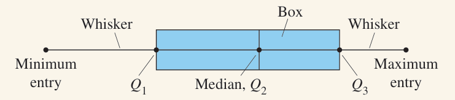

Box-and-whisker plots (or box plots) are a way of displaying data using its quartiles. Before making one, you need five numbers.

1. Minimum
2. $Q_1$
3. Median or $Q_2$
4. $Q_3$
5. Maximum

This set of numbers is known as the five-number summary, and can be thought of as percentage markers.

1. 0% of the data is below the minimum
2. 25% of the data is below $Q_1$
3. 50% is below the median
4. 75% is below $Q_3$
5. 100% is below the maximum

To make your box plot, start with a scale (i.e. number line), either horizontal or vertical, and plot your five numbers on it. The minimum and maximum should go on either end, with the others between.

Then, draw a box from $Q_1$ to $Q_3$ and make an extra line through the median.

Note that the above example does not include a scale. Do not forget to include one if drawing by hand.

## Outliers

Outliers are data that lies far outside what would be expected. The reasons for them are varied, like sampling error, extreme circumstances, etc. 

To determine if something is an outlier, what you need to define is an upper and lower limit. Anything that falls outside of those limits should be considered an outlier. And to determine those limits you need the IQR

$$ \begin{align*}
\text{Lower limit}&=Q_1 - 1.5 \cdot IQR \\
\text{Upper limit}&=Q_3 + 1.5 \cdot IQR
\end{align*}$$

So, here's a data set.

$$\begin{array}{cccccccccccccccc}
6 & 7 & 8 & 9 & 10 & 15 & 16 & 16 & 20 & 20 & 23 & 33 & 50 & 58 & 104
\end{array}$$

The second 16 is our median, so $Q_1=9$ and $Q_3=33$. That gives $IQR=24$, which means $1.5\cdot IQR=36$. Now we can find our upper and lower limits for outliers.

$$ \begin{align*}
\text{Lower limit}&=Q_1 - 1.5 \cdot IQR = 9-36 = -27\\
\text{Upper limit}&=Q_3 + 1.5 \cdot IQR = 33+36 = 69
\end{align*}$$

So, looking at our data, we have one entry that falls outside those boundaries, which is 104.