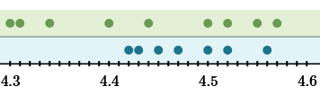
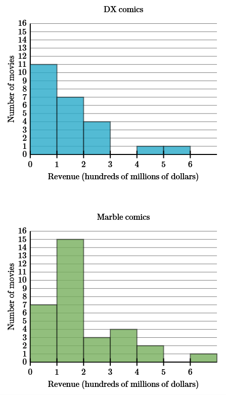

This brief section is all about comparing two distributions. And the two properties we're going to focus on are the center and the spread. Take a look at the dot plot below.

Since we are only comparing, we don't need exact calculations of the mean or standard deviation, or any other measurement of center or spread. We're just going to "eyeball" it and tell which is greater or smaller.

For the center, we want to look at the middle of each data set. Since this dot plot doesn't have any stacked dots, that's pretty straightforward. The blue set has a middle somewhere around 4.5, which is greater than the green set's middle, which is closer to 4.4. So, on average the blue data is higher.

Next is the spread. The green data has a much larger range, but the data between is fairly spread out as well. The blue data on the other hand, is clumped more. So, the green data varies more than the blue data.

## Comparing Histograms

Here's a histogram that compares comic book movie revenue.

With histograms (and dot plots if they have stacked dots) finding the peak will tell you where the average will likely be. In this case, the peak for DX movies is lower than the peak for Marble movies. So, on average Marble movies bring in more revenue.

Revenue from Marble movie also tends to vary more. While DX movies mostly fall under 300 million dollars, with a couple over 400 million, Marble movies cover almost the entre revenue axis. So, the revenue brought in by Marble movies varies more than DX movies.
