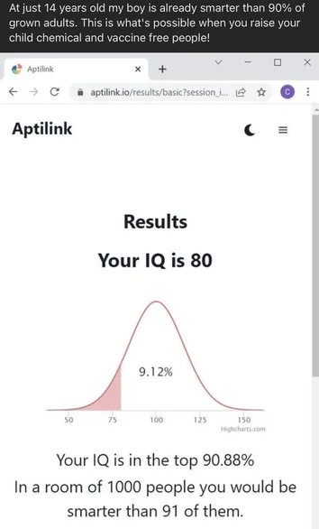
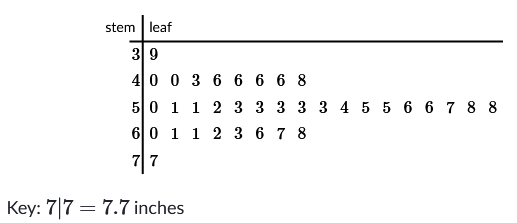

[Slideshow version](https://1drv.ms/p/c/c4097c61e06a2b97/Eb9HbXhL9spGvMRRjGzLaSYB7yMoElWDhBdTDfEt50wHiw?e=wN7RG3)

## Mean and Standard Deviation Symbols

You will see different symbols for mean and standard deviation depending on if the data in question is a population or a sample.

|                    |    Population    |  Sample   |
| ------------------ | :--------------: | :-------: |
| Mean               |    $\mu$ (mu)    | $\bar{x}$ |
| Standard deviation | $\sigma$ (sigma) |    $s$    |

## Percentiles

Earlier, we looked at medians and quartiles. Each ones of those was equivalent to a percentage. At $Q_1$, 25% of the data fell below it. With the median, 50% of the data fell below that mark. We're going to extend that idea with percentiles, where all percentages from zero to 100 are in play.

**A percentile tells us what percent of observations are *less than or equal* to a given value in a distribution.** So if you hear that something is in the 30th percentile, that means 30% of data is below that and 70% is above it. Be careful that you don't read it wrong way.

## Determining Percentile

To find a percentile, take the number of entries less than or equal[^1] the value in question, and divide it by the total number of entries. Look at the steam and leaf plot below, which has records of flower head diameters.

There are 35 entries displayed. If we look at 4.8 inches, that would be the 9th entry.

$$ \frac{9}{35} \approx 0.26 $$

So the data point is at the 26th percentile, or in other words, 26% of the data is below that point, and 74% is above it.

If you wanted to go the other way, and use a percentile to find a value, you would multiply instead. In the same example, if you wanted to to know the cutoff for the 90th percentile

$$ 0.9 \cdot 35 = 31.5 $$

Rounding is subjective, but either the 31st or 32nd data point would be the boundary for the 90th percentile. So, either 6.3 or 6.6 inches.

## Standard scores (z-scores)

Knowing a data point's position in the data set can be very informative. Percentiles are one way of doing it, with the other being z-scores. A z-score is a measure of how many standard deviations the point is from the mean. The standard deviation of a data set tells you how spread out the data is, but using that to measure distance from the mean can tell you how far away the point is from the mean.

It also makes it easier to compare data from different sets. If a data point from one set has a z-score of 1.4 compared to one that has a score of 0.6, its safe to say that the 0.6 data point is closer to the average.

To calculate the z-score you need both the mean and standard deviation. You then subtract the mean from the data entry and divide by the standard deviation.

$$ \frac{x - \mu}{\sigma} $$

This can produce negative numbers, which will indicate how far below the mean a value is.

### Example

If we have a data set (test scores in this case) with a mean of $\mu= 75$ and a standard deviation of $\sigma = 4.0$, what would be the z-score of a 64? What about 80?

For the 64

$$ \frac{x - \mu}{\sigma} = \frac{64 - 75}{4} = -2.75 $$

And for 80

$$ \frac{x - \mu}{\sigma} = \frac{80 - 75}{4} = 1.25 $$

[^1]: Some resources define percentiles as strictly less than the value, not less than or equal to. Khan does less than or equal, so we're sticking with that.
