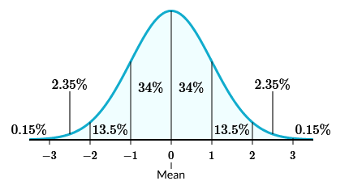

[Slideshow version](https://1drv.ms/p/c/c4097c61e06a2b97/EVrz4ZKixHRIocsj9ES0j44BNfe7nCFqkeyoXraV6IvGtw?e=VacDuX)

## Normal Distributions

For the rest of the unit we'll focus on **normal distributions**, where data sets are symmetrical and bell-shaped, like below (we'll get into the numbers in a bit).

The real math behind the curve is something for another time (or course), but you can think of it as a smoothed-out histogram. Your tallest bars are in the middle with the mean, and they get smaller as you move away.

## The Empirical Rule

The one property of normal distributions we'll get into today is the **empirical rule**, also known as the 68-95-99.7 rule. It means that 68% of the distribution's data falls within one standard deviation of the mean, 95% within two standard deviations, and 99.7% within three. The picture above is nice because it further breaks those numbers down to show what percentage falls between each standard deviation.

An example of a normal distribution would be women's heights. Most women will fall just above or below the mean height, with fewer being very short or very tall. In one survey, the mean height was 64.2 inches with a standard deviation of 2.9 inches. Using the empirical rule, we can estimate that 68% of women have a height between 61.3 and 67.1 inches.

Those percentages can also be read as probabilities. Given a random women, there is a 68% chance she will have a height between 61.3 and 67.1 inches.

So, the questions you'll see will have you interpret the empirical rule and correctly determine what percentage of the data falls within the boundaries they give.

Going back to the women's height example, what percentage of women have a height taller than 61.3 inches? Since 61.3 is one standard deviation below the mean, anything taller would be to the right of that boundary. The picture at the top will be the most helpful here.

$$ 34 + 34 + 13.5 + 2.35 + 0.15 = 84\% $$

Though, there are ways to speed things up. We're starting below the mean and going all the way up. Everything above the mean is 50%, and then the one chunk below which is 34%.

$$ 50 + 34 = 84\% $$
