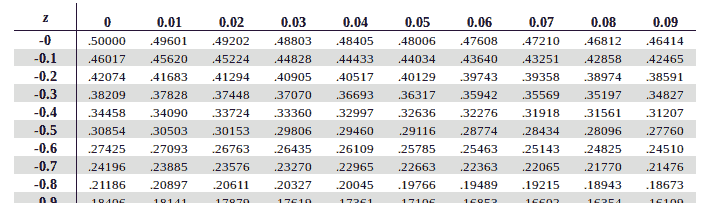
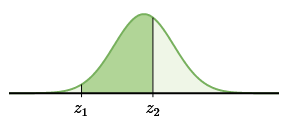

[Slideshow version](https://1drv.ms/p/c/c4097c61e06a2b97/EVrz4ZKixHRIocsj9ES0j44BNfe7nCFqkeyoXraV6IvGtw?e=VacDuX)

> Before we get started, open this PDF in another tab. You'll need to reference it during the lesson and exercises: [Standard Normal Probabilities](/misc/standard-normal-probabilities.pdf)

In the previous lesson, we looked at a normal distribution and nice round numbers of standard deviations. Specifically 1, 2, and 3 (both above and below the mean). Now we'll take that idea and extend to any standard deviation by revisiting z-scores.

For a [quick refresher on calculating z-scores](./2.3-percentiles-and-z-scores.md), subtract the mean from the given value and divide by the standard deviation.

$$ z = \frac{x-\mu}{\sigma} $$

The value you end with tells you how many standard deviations the data point is above or below the mean. Now, if the z-score happened to be a nice even number, like 1, 2, or 3, you could use the empirical rule to determine percentages. But if it's not (spoiler: it won't) that's where a z-score table comes in handy. What the table will tell you is what proportion lies below (or to the left) of the z-score.

The initial trick is learning how to read it. Here's a part of the table.

The first column is where you start. Look at your z-score and find the row that matches the beginning of it. You then move over looking at the next decimal place. So, a z-score of −0.12 will yield a value of 0.45224. That means that 45.224% of data falls below that z-score.

For another example, a z-score of −0.85 yields 0.19766.

The table gives you what proportion falls below, so in order to get above, subtract what it gives you from 1. I don't suggest doing percentage conversions unless specifically asked to do so.

If you need to find the proportion between two z-scores, you will need to lookup both values on the table, but subtract the smaller one from the larger.

The larger one will give you everything below that point, but you want to remove the part below the lower boundary, hence the subtraction.
