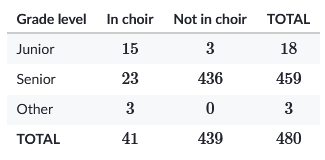
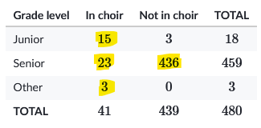

## Venn diagrams and the addition rule

If you picture a single coin, it has two sides, one typically called heads and the other tails. Flipping the coin in the air and letting it land at random means one of those two sides will be face up. The probability of one side or the other being face up is 50%. Two sides, even chances of either one being the winner.

The other way to think about that coin is with a ratio. The number of desirable outcomes (the one you are looking for) compared to the total possible outcomes. With the coin its a ratio of $1/2$, which conveniently is 50%.

With the ratio idea in mind, we can extend that to other situations that aren't as clear cut as a coin flip. Rolling a 2 on a standard 6-sided die would be $1/6$ or about 16.7%. The probability of pulling a king from a deck of cards would be $4/52$ or about 7.6%.

The trick with basic probability is determining those two numbers: your desirable outcomes and your total outcomes.

## Venn Diagrams and probability

Here is a Venn diagram of 80 wedding guests and whether they were a friend of the bride or the groom.

If we picked a guest at random, what's the probability that they were a friend of the bride? Remember that we need two numbers: the desired outcome and the total possible outcomes.

The total possible outcomes is straightforward since we have 80 people to choose from. The desired outcomes requires a little more work since their is some overlap between the two groups. While we have 17 that are friends with the bride, there are also another 42 that are friends with both. They count too, so the total number of bride's friends is $17+42=59$. That means the probability that a guest picked at random was a friend of the bride is $59/80$ or about 74%.

## Two-way tables and probability

Here is a two-way table for commencement seating.

These are different from Venn diagrams since we have overlapping variables rather than overlapping categories. A student can't be both a junior and senior at the same time, but they could be a junior and in choir. Or not in choir. Or any other combination of the two variables.

So, what's the probability of picking a student at random and them being in choir? Simple enough. There are 41 students in the choir and 480 people total. So, $41/480$ is about 8.5%.

What if we wanted someone in choir or a senior? We still have 41 in choir, and we also have 459 seniors. That gives a grand total of $41+459=500$. But that doesn't make any sense. There are only 480 people. What happened was that our group of seniors in the choir was counted twice. Looking at just the totals is misleading since you will have people that exist in both categories.

The best approach is the instead look at the internal parts of the table and ignore the totals. Find the groups that matter and total them up instead.

In this case, the groups that satisfy our conditions of either in the choir or a senior are $15+23+3+436=477$.

## Notation

In formal notation, what we did above looks like this.

$$ P(A \text{ or } B) = P(A) + P(B)$$

And sometimes it's written as

$$ P(A \cup B) = P(A) + P(B)$$

The 'or' and the cup symbol are synonymous with the word 'union'. We want to know the probability of any of those events happening, so we total them up.

## Multiplication rule for probabilities

What if you flipped two coins and wanted to know the probability of getting two heads? The same rules still apply: you need the number of desirable outcomes and total outcomes, but those numbers are less clear here. It might be helpful to list all the possibilities and then come up with a rule.

For the first flip, you can get either heads or tails. For the second it's the same, but if we keep in mind our first flip we could have heads followed by heads, heads followed by a tails, tails followed by heads, or tails followed by another tails. That gives us four possible outcomes, and one of them is a pair of heads, so $1/4$.

But the problem with coins is that both $2+2$ and $2\cdot2$ come out to four, so we can't come up with a rule just yet. Let's try one more coin. Here's all the possibilities.

1. HHH
2. HHT
3. HTH
4. HTT
5. THH
6. THT
7. TTH
8. TTT

So, a two-sided coin flipped three times gives us 8 possibilities, or $2\cdot2\cdot2$. And it turns out this works for the desirable outcomes as well. Here it is with probability notation.

$$P(A \text{ and } B) = P(A)\cdot P(B)$$

Which you might also see as 

$$P(A \cap B) = P(A)\cdot P(B)$$

While we focused on 'or' events last time, where only one thing is happening our another, we are looking at 'and events, where multiple events are happening. This is also referred to as the intersection, where the two events in question meet.

## Independent vs dependent events

Flipping a coin is known as an independent event, since the results of one flip have no impact on the results of the next.

A dependent event, for example, would be when you draw multiple cards from a deck. The same basic idea still applies from earlier with multiplication, but we need to determine the individual events carefully.

If we wanted to know the probability of drawing two kings from a deck, back to back, we need to look at the first draw and then, keeping in mind we just removed a king from the deck, we look at the second one. The first draw is simple since we have a full deck: $4/52$. The next one though, assuming we drew the king we wanted, would be $3/51$. One less king to grab and one less card in the deck. Now you can multiply to get an overall probability of 0.45%. Pretty slim chance.

The notation for this is slightly different.

$$P(A \cap B) = P(A)\cdot P(B | A)$$

The line is read as 'given that', so the probability of $B$ given that $A$ happened.
