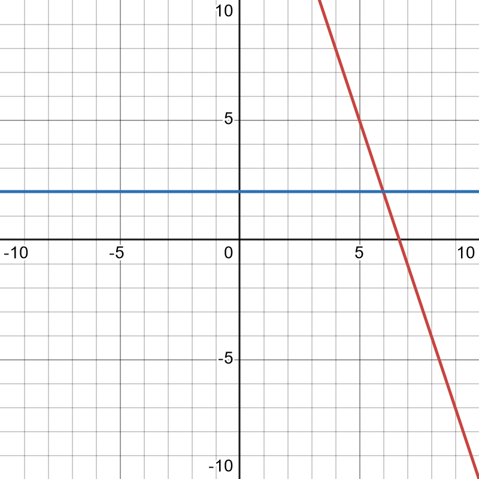
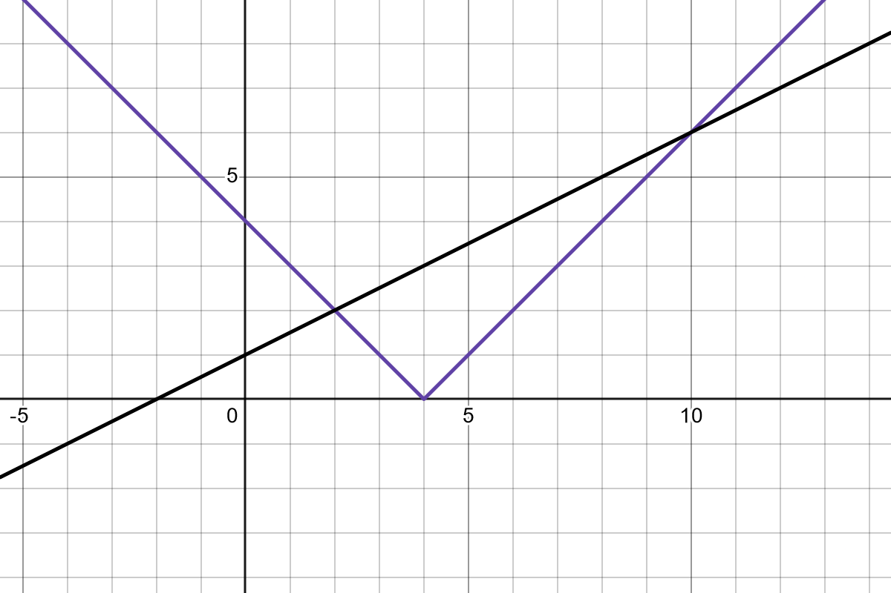
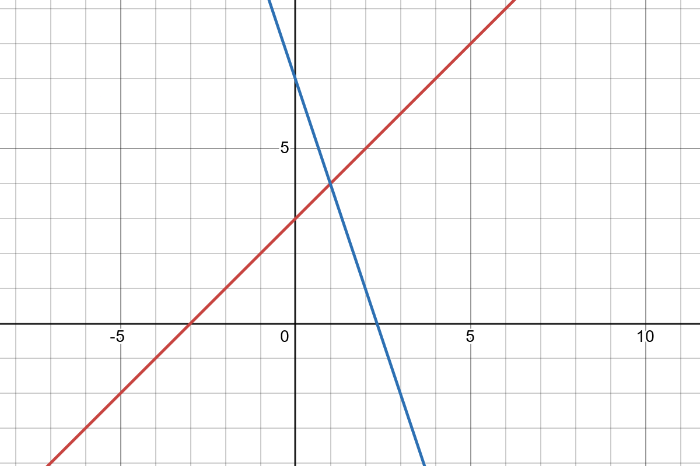
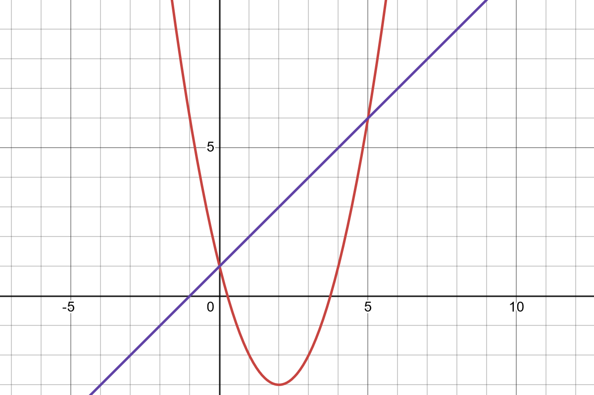

Given an equation, or an inequality, you can graph both sides of it to find the solution.

$$ -3x+20 = 6$$

If we treat this as two separate functions, one being $f(x)=-3x+20$ and the other $g(x)=6$, we can graph both and any intersection points will show our solution.

You can see the intersection at $(2,6)$. So, when $x=2$, both of our functions yield 6, meaning our solution is 2. It's important to keep in mind that your domain will dictate the solution. _We are looking for an input that generates the same output for both functions._

If the graphs have multiple intersection points, that means there are multiple solutions.

$$|x-4|= \frac{1}{2}x+1$$

Graphing both sides yields

Intersections are at $(2,2)$ and $(10,6)$. So, our solutions are at $x=2$ (which produces a 2 in both functions) and $x=10$ (which produces a 6 in both).

## Inequalities

The method is the same for inequalities, but the interpretation is where it differs. Your intersection points are still important as they will be the boundaries of your solution, but then you have to take note of which functions is above (greater) or below (lesser).

$$ x + 3 > 7 - 3x $$

Our intersection point is $(1,4)$. Before that point (negative side of the $x$-axis), $x+3$ is below, or lesser than, $7-3x$. After that point, where they are equal, it switches. So, $ x + 3 > 7 - 3x $ when $x > 1$.

Let's try another one.

$$ x^2-4x+1 > x + 1$$

Looking at the graph, there are two intersections and because of that, three intervals. We want the ones were our parabola is above the line. There are two intervals where that's true. So,

$$ x <0 \quad\text{or}\quad x > 5 $$

There is an "or" in there since either condition can be true for the solution.

If the inequality was reversed, and we wanted where the parabola was below the line, then

$$ 0 < x < 5$$

which could also be written as 

$$ x > 0 \quad\text{and}\quad x < 5 $$

You could also do interval notation with $(0,5)$.
