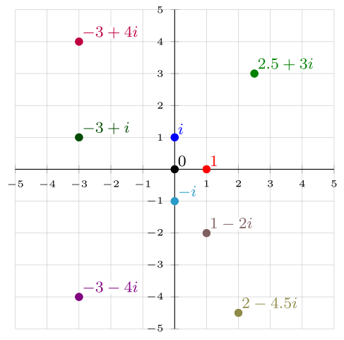
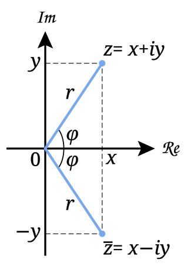

> **Vocabulary**
>
> - complex conjugates
> - complex number
> - imaginary number
> - imaginary unit $i$

---

Today, we will solve this seemingly unsolvable equation.

$$ x^2 = -1$$

> Some context: people once thought [negative numbers were absurd](https://en.wikipedia.org/wiki/Negative_number#History) and questioned [if zero was even a number](https://en.wikipedia.org/wiki/0#Classical_antiquity). So, what we will cover here might seem wild, but that's because a) it was formalized rather recently in the 1800s, and 2) unlike the concept of zero and negative numbers, it hasn't found a way to be terribly useful in everyday mathematics.

Let's look at the equation $x^2 = 9$ first. The other way to write it would be $x\cdot x = 9$, or even more accurately

$$1\cdot x \cdot x = 9$$

Here, since we are multiplying, 1 is our starting point. We rarely see or acknowledge it, but it's there. So, we need to take one and multiply it by some number twice, and end up with 9. Our two candidates are 3 and −3. With both, we scale by 3 twice, but I want to focus on the sign instead.

If you put 1 on a number line with a line drawn to it from 0, multiply by 3, then 3 again, you'll see that you keep the same direction relative to zero. 1 is to the right, so is 3, and so is 9.

With −3, we change directions twice. We start at 1, switch directions to the left at −3, then switch back to the right at 9.

This is why we assume that squaring a number always results in a positive. If we start in a positive direction (our default 1), multiplying by another positive number doesn't change your direction, and multiplying by a negative twice just puts you back where you were.

So, let's make some other assumptions and see what happens.

## The Assumption

First, let's just assume that $x^2=-1$ has a solution. It absolutely does, but since I might have to convince you, it's helpful to be open-minded.

Now, let's assume that what we were doing before with multiplying by negatives and positive wasn't flipping direction (or non-flipping in the case of positives), it was instead rotations. Multiplying by a positive means no rotation, or rotation of 0º, and multiplying by a negative means rotating by 180º. So, multiplying by a negative twice gives us 360º, so back to positive again.

With our perspective changed to rotations instead of flips, now we can go back and reexamine our original problem.

$$ 1 \cdot x \cdot x = -1$$

The question is now what _rotation_ applied twice will give us a −1? A −1 is opposite of 1, so 180º is needed. Well, what's half of 180º?

90º.

OK, we don't have a number on the number line that does that. We just have left and right, or 0º and 180º. If we wanted 90º, we would have to go up.

Wait. If we want to go up, we would need a second number line, one that goes up and down instead of left and right. We have something like that already. What if we just took our $(x,y)$ coordinate plane and applied it to our number line. We'll call the horizontal axis the real part of the number, and the new one the imaginary part.

Perfection. And now we can define $i$ in terms of our other real numbers.

$$\begin{align*}
i^2 &= -1\\
i &= \sqrt{-1}
\end{align*}$$

So, we have devised the **imaginary unit $i$** such that when you square it, you get −1. And, despite us "imagining" it, it plays nicely with other mathematics, putting in on level with the discovery of zero and negative numbers.

## Solving Simple Quadratics With $i$

So, what's the solution to $x^2=-9$? If you can remember that

$$i^2=-1$$

or even better

$$ i = \sqrt{-1}$$

then you can rewrite the problem.

$$\begin{align*}
x^2 &= 9 \\
\sqrt{x^2} &= \sqrt{-9} \\
x   &= \sqrt{9}\cdot\sqrt{-1}\\
x   &= 3i
\end{align*}$$

## Complex Numbers

So, with this whole 90º rotation thing, we've revealed that numbers are actually two-dimensional, since now they can move above and below the number line.

This new plane is called the complex plane and it houses complex numbers. This plane behaves just like the $(x,y)$ coordinate plane you are already familiar with, but instead of an $x$-axis, it has a real axis, and replacing the $y$-axis is the imaginary axis. **Complex numbers**, therefore have a real component and an imaginary one. And instead of writing them as a pair of coordinates, we write it as a sum. So, the complex number with 1 in the real part and 2 in the imaginary part would be written as

$$ 1 + 2i $$

Your real numbers that you are used to, have an imaginary component of 0. On the flip side, an **imaginary number** has a real component of 0, like the number $5i$.

And it turns out you can do the same things to complex numbers that you could do to real numbers. And $i$ behaves like any other number or variable. You can add them.

$$ (1 + 2i) + (3 - i) = 4 + i$$

And you can multiply them.

$$\begin{align*}
(1 + 2i)(3 - i) &= 3 - i + 6i -2i^2 \\
                &= 3 + 5i - 2i^2 \\
                &= 3 + 5i + 2 && \color{gray}{\text{Substitute }i^2=-1}\\
                &= 5 + 5i
\end{align*}$$

## Conjugates

In some cases, eliminating the imaginary part of a complex number is helpful. A **complex conjugate** helps with that since it is the same number flipped over the real axis of the complex plane.

So, multiplying a pair of conjugates results in a number with only a real component.

$$\begin{align*}
(3 + 4i)(3 - 4i) &= 9 - 12i + 12i - 16i^2 \\
                 &= 9 + 16 \\
                 &= 25
\end{align*}$$

You can use conjugates in order to rewrite rational expressions where a complex numbers in the denominator might be undesirable.

$$\begin{align*}
\frac{10}{2-i} \cdot \frac{2+i}{2+i} &= \frac{10(2+i)}{4+1} = 2(2+1) = 4 + 2i
\end{align*}$$

## ~~Difference~~ Addition of Squares

We've seen difference of squares in action.

$$ x^2 - 25 = (x+5)(x-5) $$

Now we can also work with the addition of squares. Must make the problem a subtraction one, while flipping the sign of the second term.

$$ x^2 + 25 = x^2 - (-25) = (x + 5i)(x - 5i) $$
