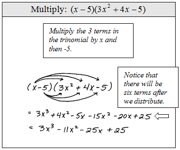

Add, subtract and multiply polynomials.

p144 10–17, 19–32

---

Adding and subtracting polynomials is where you combine like terms. Just remember that you can only add terms with the same variables and exponents. Watch your signs and you should be OK.

Multiplying them, on the other hand, can be a bit complicated. The basic idea is to take each term from one polynomial and multiply it by each term in the other.

*Source [OpenAlgebra.com](https://www.openalgebra.com/2012/11/multiplying-polynomials.html)*

All those multiplications can be tough to keep track of, so you can also use a table to stay organized.

|        |  $x$  | $-5$  |
| ------ | :---: | :---: |
| $3x^2$ |       |       |
| $4x$   |       |       |
| $-5$   |       |       |

Multiply your row and column headers

|        |  $x$   |   $-5$   |
| ------ | :----: | :------: |
| $3x^2$ | $3x^3$ | $-15x^2$ |
| $4x$   | $4x^2$ |  $-20x$  |
| $-5$   | $-5x$  |   $25$   |

and then add up your like terms. Assuming your polynomials are in standard form, you should see like terms along diagonals.

## Closure

For the sake of good number sense, a concept you should be aware of is **closure**, which is when an operation on numbers from a set produce a number on the same set. For example, the set of positive numbers is closed under addition. Take any two positive numbers, add them together and you'll get another positive number.

As a counter example, the set of positive numbers is *not* closed under subtraction. Subtracting a larger positive number from a smaller one yields a negative, which is outside the set.

The book specifically mentions polynomials being closed under addition and subtraction, which they accompany with a simple proof. I suggest reading through it and making sure you understand how they arrived at their conclusion.
