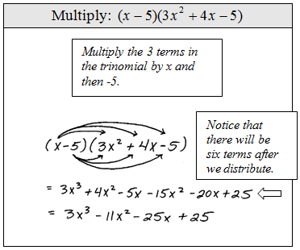

{: .lesson-dates}
Lesson date: February 19, 2025.

- Identify the degree and leading coefficient of polynomials.
- Add and subtract polynomials.
- Multiply polynomials.
- Use FOIL to multiply binomials.
- Perform operations with polynomials of several variables.

## Assignment

- 1–4, 5–53 odd
- *Recommended*: all **vocabulary** and concept blocks copied into notes

---

## Parts of a Polynomial

A **polynomial** is a sum of terms. A **term of a polynomial** contains a variable raised to a non-negative integer power. Each of those terms also has a **coefficients**, which is just a number being multiplied by the variable.

$$\begin{align}
3x^2 + 4x - 7
\end{align}$$

In the polynomial above, there are three terms. The variables and powers for the three terms are $x^2$, $x^1$, and $x^0$. Though, $x^1$ is written and just $x$ and since $x^0=1$, it's not written at all. The coefficients are $3$, $4$, and $-7$, though that last term is typically referred to as a **constant** since it does not have a variable.

The **degree** of a polynomial is determined by the term with the largest exponent. So above, the degree of that polynomial is $2$. The term that determines the degree is called the **leading term** and its coefficient the **leading coefficient**. The leading term in the example is $x^2$ and the leading coefficient is $3$.

If a polynomial is written in **standard form**, then its terms are written in descending order with the leading term at the front. Here is a polynomial *not* written in standard form, but then rewritten to fit it.

$$\begin{align}
-7 - 2x^4 + 6x - x^3 = -2x^4 - x^3 + 6x - 7
\end{align}$$

## Adding and Subtracting Polynomials

You can add or subtract polynomials by combining like terms. **Like terms** are terms that share the exact same variables raised to the exact same power. So, $3x^2 + 5x^2 = 8x^2$.

You can think of the variables as units or labels, similar to how $3\, \text{inches} + 5\, \text{inches} = 8\, \text{inches}$. A different variable or power means they can't be added together, like trying to add inches to gallons. The terms $x^2$ and $x^3$ can't be combined and neither can $x^2y$ and $xy^2$.

$$\begin{align}
(12x^2+9x-21)+(4x^3+8x^2-5x+20) = 4x^3 +20x^2+4x-1
\end{align}$$

## Multiplying Polynomials

To multiply polynomials, take each term from the first and multiply it by each term in the second. Multiplication doesn't have the same like term restriction, so you are free to multiply anything by anything else.

All those multiplications can be tough to keep track of, so you can also use a table to stay organized.

|        |  $x$  | $-5$  |
| ------ | :---: | :---: |
| $3x^2$ |       |       |
| $4x$   |       |       |
| $-5$   |       |       |

Multiply your row and column headers

|        |        $x$         |         $-5$         |
| ------ | :----------------: | :------------------: |
| $3x^2$ | $\color{blue}3x^3$ | $\color{red}-15x^2$ |
| $4x$   | $\color{red}4x^2$ |  $\color{green}-20x$  |
| $-5$   | $\color{green}-5x$  |   $\color{black}25$   |

and then add up your like terms. Assuming your polynomials are in standard form, you should see like terms along diagonals.

### Special Forms

These are tricks to speed things up as these special forms tend to appear often. If you don't remember them, don't worry. You can still multiply these using the distributive property.

> #### Perfect Square Trinomial
>
> To square a binomial quickly, square the first term, multiply both terms and double it, and square the last term.
> 
> $$\begin{align}
> (a+b)^2 = a^2 + 2ab + b^2
> \end{align}$$
{: .definition}

Here's one worked out the long way so you can see it in action.

$$\begin{align}
(x-3)^2 &= (x-3)(x-3) \\
        &= x^2 - 3x - 3x + 9 \\
        &= x^2 - 6x + 9
\end{align}$$

Above, the sign between the two terms doesn't matter. For the next one it does.

> #### Difference of Squares
>
> A binomial multiplied by its conjugate (opposite sign between the two terms) results in the difference of each term squared.
>
> $$\begin{align}
> (a+b)(a-b) = a^2-b^2
> \end{align}$$
{: .definition}

And here is one worked out.

$$\begin{align}
(2x-3)(2x+3) &= 4x^2 + 6x - 6x - 9 \\
             &= 4x^2 - 9
\end{align}$$
